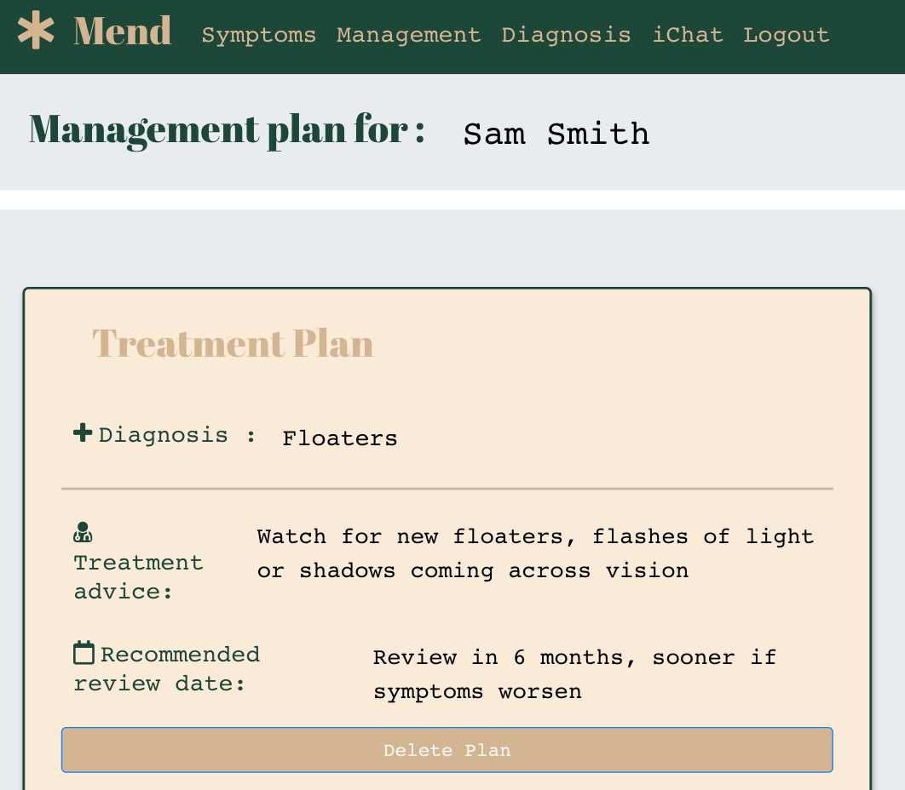
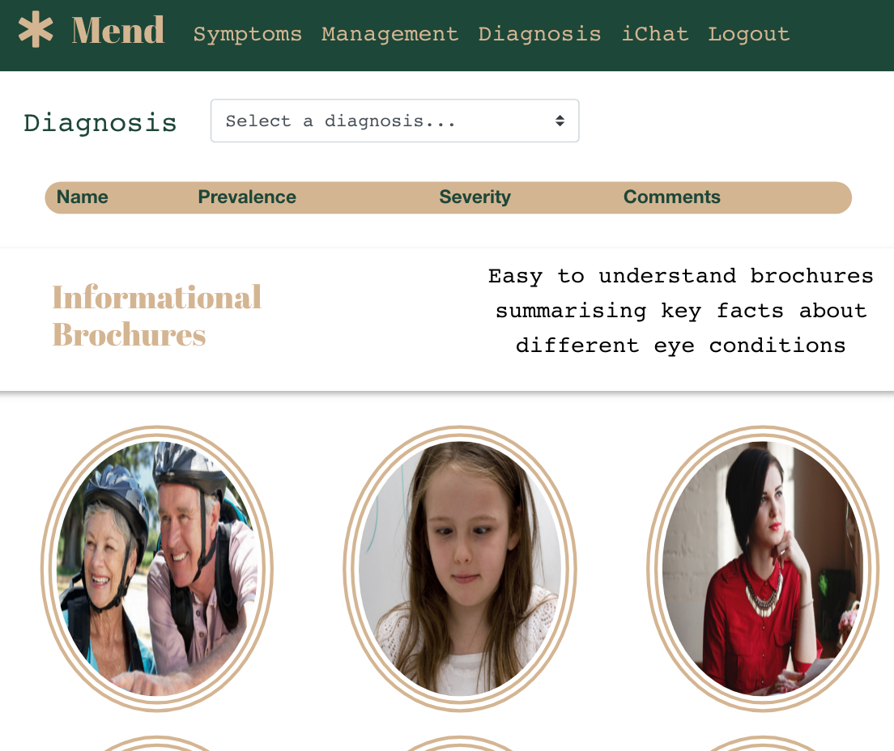
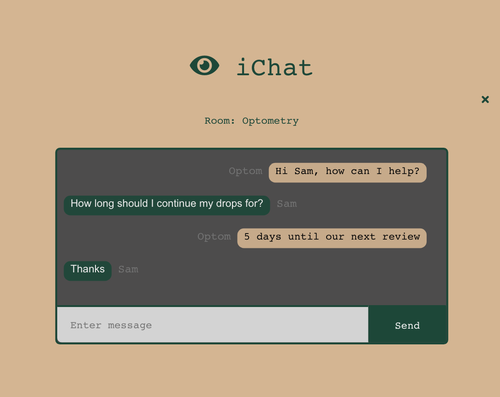
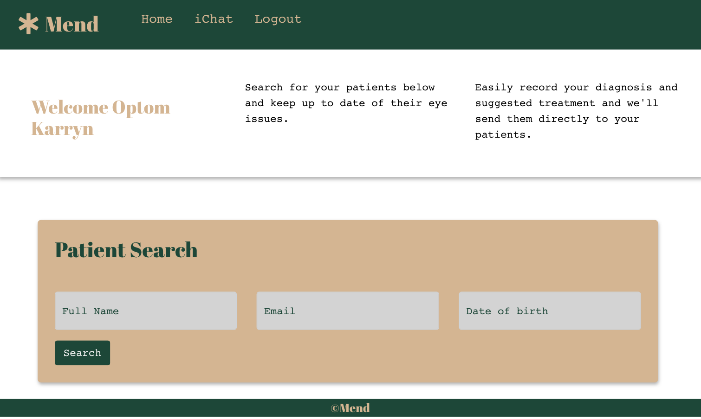

## Mend 

## Description 
Mend is a MERN stack application where patients and optometrists can record and communicate their eye issues and management plans easily. This platform allows for users to learn more about eye conditions and encourages a community where users and optometrists can engage in live chats. 

---
| Table of Contents |
|---|
| [User Story](#UserStory) |
| [Functionality](#Functionality) |
| [ScreenShot](#ScreenShot) |
| [Links](#Links) |
| [Front End Tech](#FrontEndTech) |
| [Back End Tech](#BackEndTech) |
| [Other Technologies](#OtherTechnologies) |
| [License](#License) |
| [Contributing](#Contributing) |
| [Questions](#Questions) |
---

## User Story
As a patient with a new eye issue I want to easily track my symptoms and review treatment advice given to me by the optometrist so that my recovery and eye health remains on track.

As an optometrist I want to accurately understand a patient’s eye issue(s) and formulate advice so I can help treat and manage my patients effectively.

## Functionality 
* Has 2 user entry points - Patient and Optometrist
* Model View Controller Design Pattern.
* User data is saved into MongoDB and updated with mongoose.
* CRUD best practices followed.
* Single Page App utilising Bootstrap column system design.
* Deployed to Heroku.

## Screenshot
Application should look like below:

 

 

 

## Links
### Github Repository
Github : https://github.com/KarrynS/Mend.git

### URL
Deployed : https://mend2021.herokuapp.com/

## Front End Tech
* React
* JavaScript
* Bootstrap
* HTML
* CSS

## Back End Tech
* Node.js 
* JavaScript 
* Heroku
* Express
* MongoDB
* Passport

## Other technologies
* react-moment
* InfermedicaAPI
* bycrypt
* socket.io. 

## License 

## Contributing
To contribute please refer to https://github.com/microsoft/vscode/wiki/How-to-Contribute

## Questions
Please direct questions to the following email: karrynsaw@gmail.com

Github: https://github.com/KarrynS